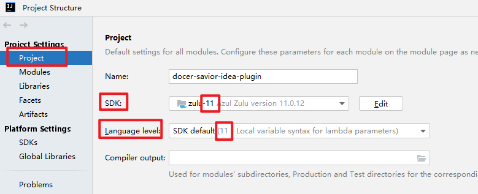
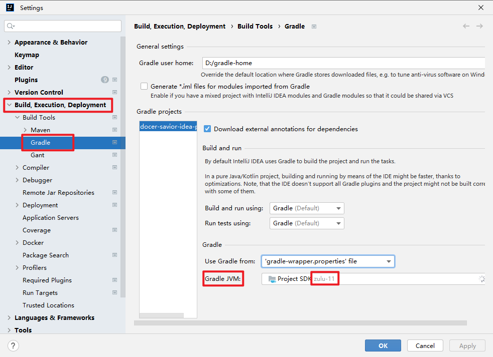
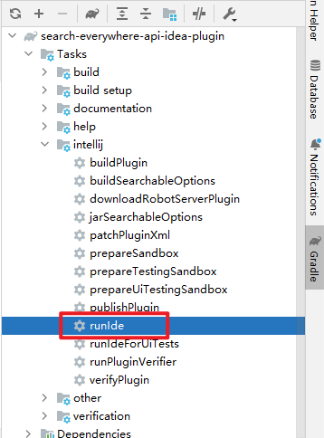
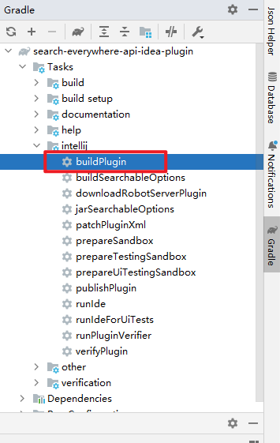

# 贡献指南
> 首先，感谢您考虑为这个项目做出贡献。像您这样的人使这个插件成为如此出色的工具。

## 提问题
> 目前，我们使用 Github Issues 管理缺陷，请您在 [Issues 页面](https://github.com/gudqs7-idea-plugins/api-savior/issues) 提交 `错误报告`

## 提建议
> 目前，我们使用 Github Issues 收集建议，请您在 [Issues 页面](https://github.com/gudqs7-idea-plugins/api-savior/issues) 提交 `功能建议`  

另外，当您对某些功能需要讨论时，也欢迎在 [Github 论坛](https://github.com/gudqs7-idea-plugins/api-savior/discussions) 发帖！

## 提 PR

> 当您打算这么做时，请先接受感谢！然后，我会告诉您具体该怎么做！  

- 首先，请一定记得 Fork 这个仓库到您自己的账号，在进行代码的修改！  

### 确定分支
- 一般的，使用最新的 `master` 分支即可。
- 当您需要在某个版本上做修改时，您可通过 `version/x.x.x` 来确定分支，如 2.0.9 版本则为 `version/2.0.9`；另外，这种情况下提交 PR 时请合并到 `version/x.x.x` 分支。

### 开发调试
> 本项目使用的是较新的插件开发方式（即采用 Gradle)，您只需要用 IDEA 打开这个项目即可！
> 以下是一些注意事项：

- 目前 IDEA 本身的 Java 运行时基本要求 Java 11，因此您必须确保拥有这个版本的 JDK。
- 打开项目后，若您平时开发项目常用的是 Java 8，可能您需要做一些设置，如：

#### 项目 SDK 设置

#### Gradle JVM 设置为 11

> 剩下的就看网络了，此过程或下载一个 IDEA 社区版（一般600多M），一个 JBR （运行时，About 时可见），还有依赖 jar 等  

### 运行和打包

#### 运行

#### 打包

#### 代码结构说明

cn.gudqs7.plugins 下有 5 个主要的包，即 `common / savior / diagnostic / generate / search`，作用如下：
- common: 一些公共的类，工具及基类
- savior：Api 文档插件相关的一切
- diagnostic：接入 IDEA 异常处理组件
- generate：实体类快速 get / set 方法生成
- search：Search Everywhere 中 Api 这个 Tab 的接入及实现

> 更多代码上的疑问或是建议欢迎通过邮件或提 Issue 来咨询我！