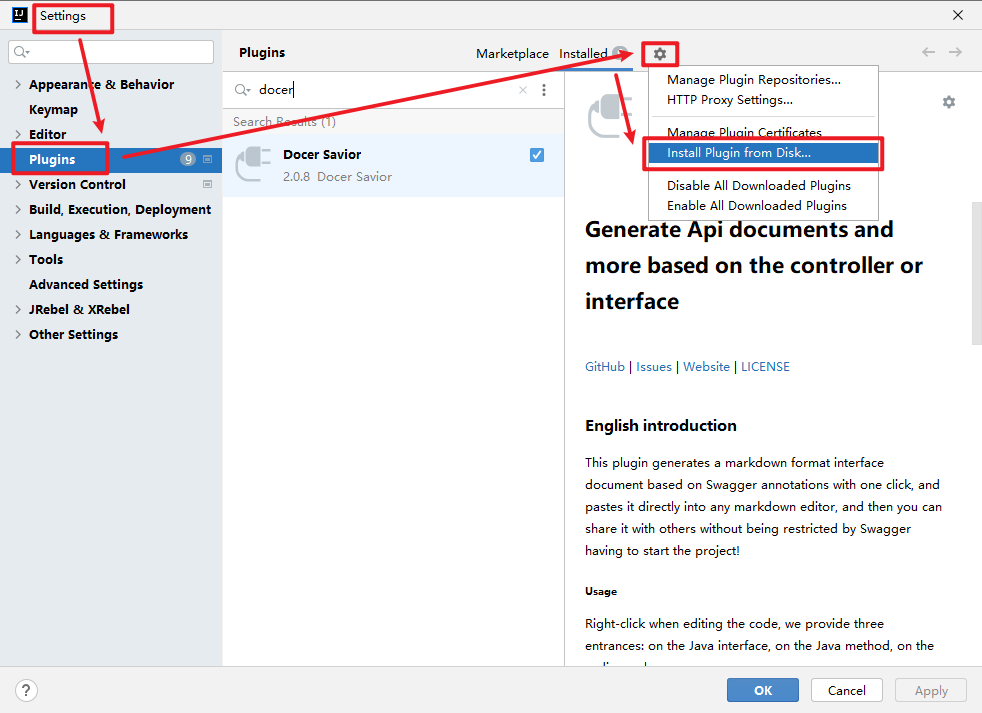
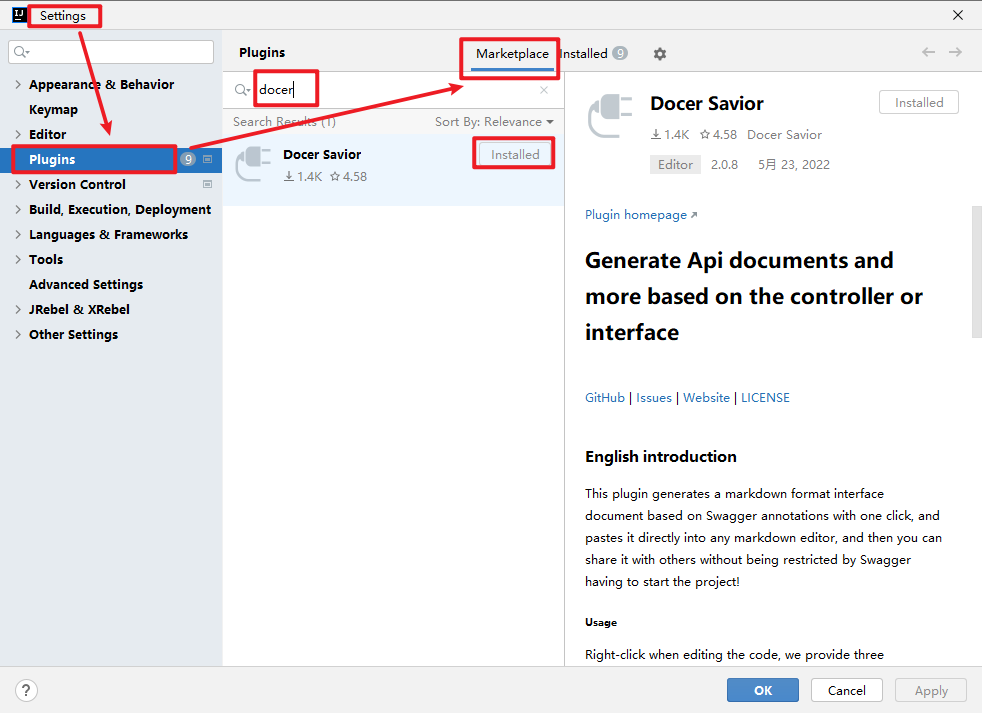
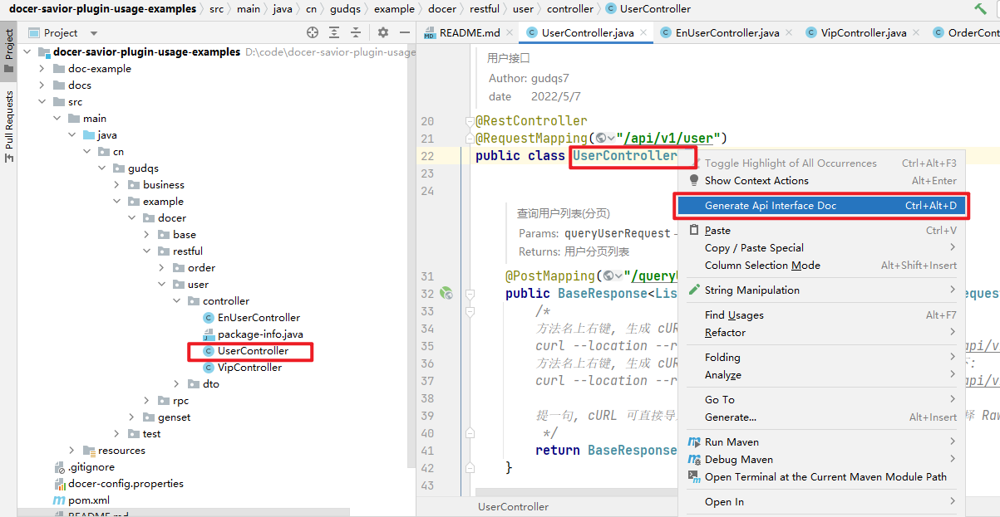
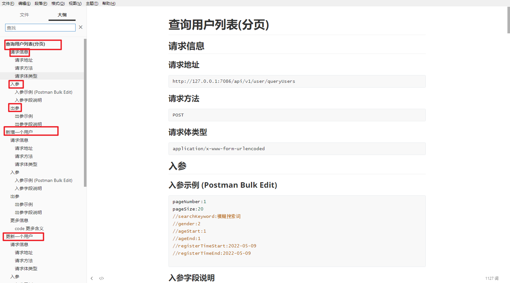
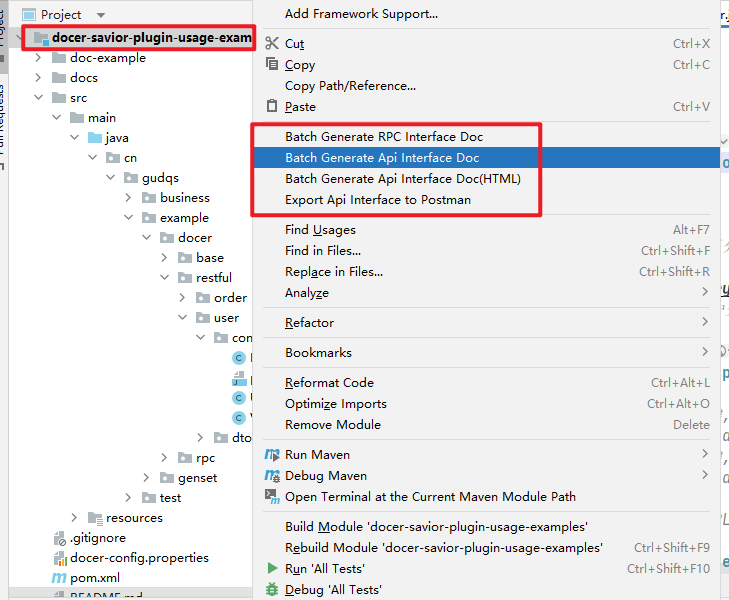
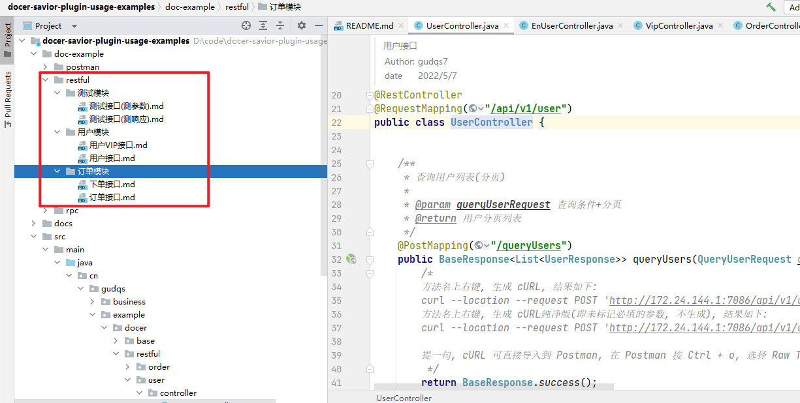

[release-img]: https://img.shields.io/github/release/docer-savior/docer-savior-idea-plugin.svg
[latest-release]: https://github.com/docer-savior/docer-savior-idea-plugin/releases/latest
[plugin-img]: https://img.shields.io/badge/Idea%20Plugin-Api%20Savior-orange.svg
[plugin]: https://plugins.jetbrains.com/plugin/16860
[jet-img]: https://img.shields.io/badge/plugin-Install%20Plugin-4597ff.svg
[jet]: http://localhost:63342/api/installPlugin?action=install&pluginId=gudqs7.github.io.doc-savior

[](CODE_OF_CONDUCT.md)
[](LICENSE)
[![GitHub release][release-img]][latest-release] [![Jetbrains Plugins][plugin-img]][plugin]
[][plugin]
[][plugin]
[![Install Plugins][jet-img]][jet]

---
[Chinese 🇨🇳](./README.md)

# What does Api Savior do?

- is an IDEA plugin that supports Java only.
- Generate HTTP interface documentation, which supports markdown and html in format, in order to replace Swagger.
- In theory, all HTTP interfaces developed by Spring MVC annotations are supported, and `Feign` microservices are also supported. In addition, the pure interface writing method of `Dubbo` is also supported.
- At the same time, it comes with some related small capabilities, such as support for exporting to Postman, support for generating cURL commands, support for generating description document tables and json examples for a single data transfer class.
- Ported and improved the functions of two plugins: [Github GenerateAllSetter Pull#66](https://github.com/gejun123456/intellij-generateAllSetMethod/pull/66) | [Github genSets](https://github.com /yoke233/genSets)

## Difference with Swagger

- Modify at any time, generate at any time, no need to start the project
- Support for java doc comments
- Support RPC interface (ie Dubbo/Feign)
- Generated documentation with input/output parameter examples, more intuitive
- A variety of carriers, not limited to web pages or documents; for example, exporting to Postman is currently supported, and subsequent exporting to Yapi, or similar platforms can be easily implemented; our purpose is to write a comment once, and it will work for a lifetime!

# Why is this project useful?

1. Code always needs some comments, and good memory is not as good as bad writing; and now, there is another good reason to write good comments!
2. Every time I write an interface document, I feel like I am doing hard work, especially the management of the background business. It is often the addition, deletion, modification and checking of several tables, which means at least a dozen interfaces. This is completely avoidable!
3. This plugin does not only generate interface documents, but also implements more lazy ways (as long as it is related to interfaces), and there are many more waiting for us to discover!

# How do I get started?

## 1. Install the plugin
### zip package installation
Download the zip package from the latest [Release][latest-release] page, then open IDEA, go to Settings --> Plugins --> Pinion --> Install Plugin from Disk


### Marketplace Installation
Open IDEA, go to Settings --> Plugins, select Marketplace, enter api savior and click Install  


## 2. Open a Spring MVC or Dubbo project
It is recommended to open the example project I specially prepared: [docer-savior-plugin-usage-examples](https://github.com/docer-savior/docer-savior-plugin-usage-examples)

```shell
git clone https://github.com/docer-savior/docer-savior-plugin-usage-examples
````

## 3. Generate documentation
Find a Controller or RPC interface class,  
Such as `cn.gudqs.example.docer.restful.user.controller.UserController`  
Right-click on the class name and click Generate Api Interface Doc  
  
The document is as follows  
  


## 4. Batch document generation and more
Right-click directly on the project (or a directory/a class/any multi-selection), and then click the corresponding button, as shown below  
  

Suppose I click Batch Generate Api Interface Doc, I will get a folder, the Markdown interface document of the molecule folder by module (can be customized, the default is the last two levels of registration), as shown below  


## 5. Search APIs through Search Everywhere
Double-click `Shift` to enter `Search Everywhere` and switch to Api, or use the shortcut keys `Ctrl + \ ` or `Ctrl + Alt + N` to enter the interface as shown below.
At this point you can search and jump to the interface by url or interface description.
> For this purpose, I opened a separate project [search-everywhere-api-idea-plugin](https://github.com/docer-savior/search-everywhere-api-idea-plugin), welcome to Star!  


# Where can I get more help if needed?

## Get help by submitting an issue
[Click to visit Github Issue](https://github.com/docer-savior/docer-savior-idea-plugin/issues)
> Everyone is welcome to ask questions, and everyone is welcome to improve it together!

**In addition, I have connected to the error handling component of IDEA, so when I find an error message from the plugin, follow the IDEA prompt to view the error information and report it to me with one click (that is, an issue is automatically generated)**

## See the wiki for more instructions

- [Getting Started Tutorial](https://github.com/docer-savior/docer-savior-idea-plugin/wiki/Get-Started)
- [Advanced Tutorial](https://github.com/docer-savior/docer-savior-idea-plugin/wiki/More-Details)

## Understand the actual use of the project by viewing the demo example

- [Click to view the HTML format document effect of the example project](https://docer-savior.github.io/docer-savior-plugin-usage-examples/)
- [Click to visit the example project Github](https://github.com/docer-savior/docer-savior-plugin-usage-examples)

## Contribution Guidelines
[Contribution Guidelines](CONTRIBUTING_EN.md)

# Acknowledgments

- [Github intellij-generateAllSetMethod](https://github.com/gejun123456/intellij-generateAllSetMethod)
- [Github genSets](https://github.com/yoke233/genSets)
- [Github RESTKit](https://github.com/newhoo/RESTKit)
- Thanks to [JetBrains OpenSource](https:jb.ggOpenSourceSupport) for the full product license for this project!

[](https://jb.gg/OpenSourceSupport)